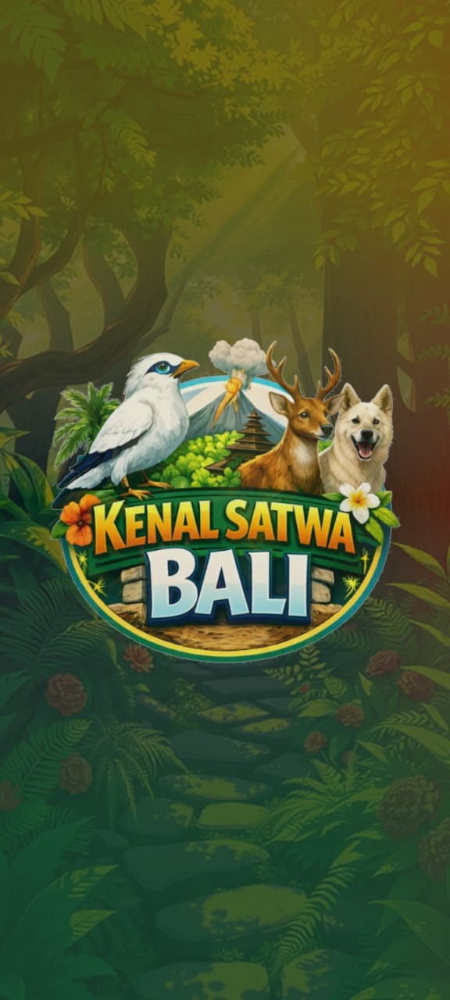
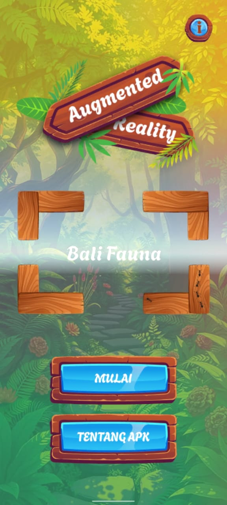
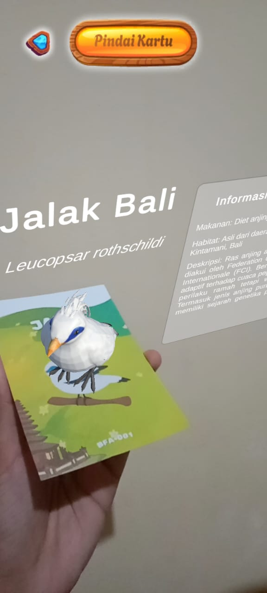
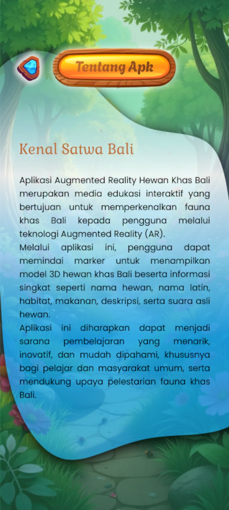
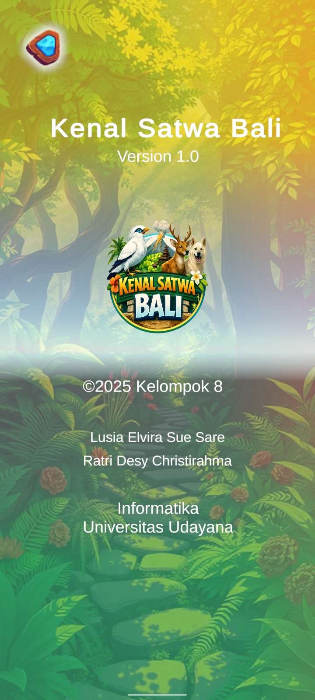

# 🐾 Kenal Satwa Bali – Augmented Reality App

**Kenal Satwa Bali** adalah aplikasi **Augmented Reality (AR)** berbasis Android yang bertujuan sebagai **media edukasi interaktif** untuk mengenal satwa khas Bali.  
Aplikasi ini memanfaatkan teknologi AR agar pengguna dapat melihat **objek 3D satwa**, disertai **informasi dan audio edukasi**, sehingga proses belajar menjadi lebih menarik dan mudah dipahami.

---

## 🎯 Tujuan Aplikasi
- Menyediakan media pembelajaran edukatif berbasis teknologi AR  
- Meningkatkan ketertarikan pengguna dalam mengenal satwa Bali  
- Menggabungkan elemen visual, audio, dan interaksi dalam satu aplikasi  

---

## ✨ Fitur Utama
- 📷 **Image Target AR** menggunakan Vuforia  
- 🦁 **Model 3D satwa** khas Bali  
- 🔊 **Audio narasi edukasi**  
- 📖 **Informasi satwa** dalam bentuk teks  
- 📱 Berjalan pada **perangkat Android**

---

## 🛠 Teknologi yang Digunakan
- **Unity**  
- **Vuforia SDK**  
- **C#**  
- **Android Platform**

---

## 📦 Unduhan
- 📱 **File APK Aplikasi**  
  👉 [Download APK](https://drive.google.com/file/d/1e5PedWGyad5gC587gZN76W6war7hAVBV/view?usp=drive_link)

- 📘 **Buku Edukasi (PDF)**  
  👉 [Download Buku Edukasi](https://drive.google.com/file/d/1pLrylXFu__vv7oZlBLmkEN7DLaIk6kJy/view?usp=sharing)

> File disediakan melalui Google Drive untuk memudahkan akses dan distribusi.

---

## 🖼 Dokumentasi
Aplikasi ini menggunakan pendekatan **Augmented Reality berbasis marker**, di mana objek 3D dan audio akan muncul setelah kamera berhasil memindai image target.

  
  
  
  
  

---

## 👩‍💻 Pengembang
**Vira & Ratry**  
Mahasiswa Informatika  
Universitas Udayana  

Mata Kuliah: **AR / VR**  

---

## 📝 Catatan

Pengembangan aplikasi ini ditujukan untuk keperluan pembelajaran dan akademik. Desain antarmuka aplikasi diadaptasi dari Figma Community, sedangkan model 3D diperoleh dari beberapa situs penyedia model 3D gratis. Seluruh aset digunakan sebagai media edukasi dan tidak untuk tujuan komersial.

---

⭐ Terima kasih telah melihat project ini!  
Silakan unduh aplikasi dan buku edukasi untuk mencoba pengalaman belajar berbasis AR 🚀
